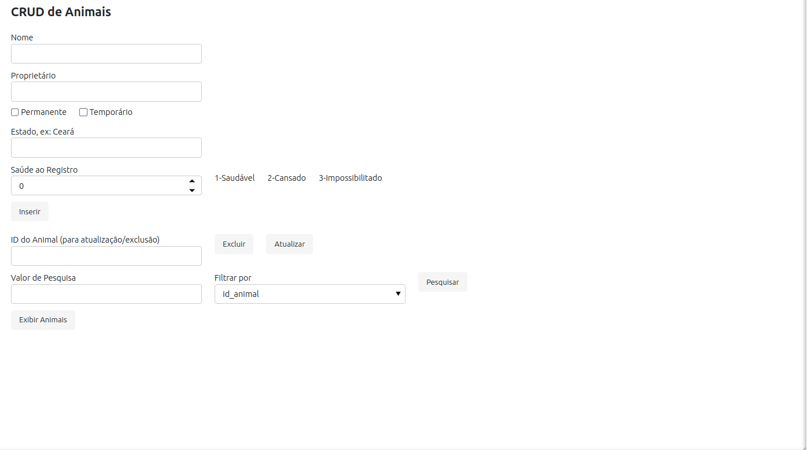
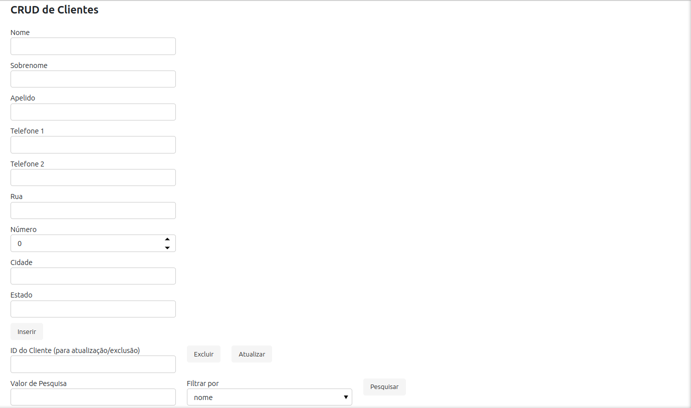
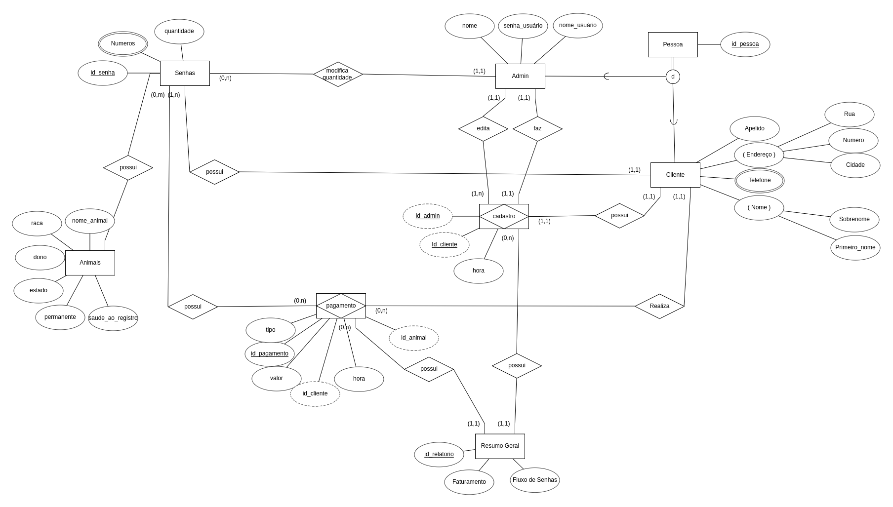
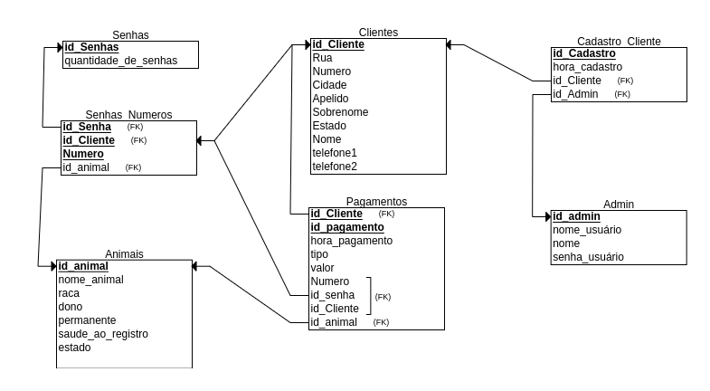

# Projeto de Fundamentos de Bancos de Dados - VQR Lite

## Descrição do Projeto
O projeto VQR Lite consiste na implementação de duas telas CRUD (Create, Read, Update, Delete) e uma tela de relatório, utilizando as tecnologias Pandas, Python e Panel. O trabalho foi desenvolvido em ambiente Jupyter Notebook.

### Telas CRUD
- **CRUD_Animais:**


- **CRUD_Cliente:**


### Tela Relatório
- **ResumoGeral:**


## Funcionalidades Implementadas
### Telas CRUD:
Foram implementadas duas telas para realizar operações CRUD em um banco de dados. Essas telas possibilitam a criação, leitura, atualização e exclusão de registros.
### Relatório:
Foi criada uma tela de relatório para apresentar informações consolidadas ou estatísticas relevantes do banco de dados.
### Trigger:
Implementação de uma trigger que atualiza automaticamente o valor da quantidade de senhas disponíveis, demonstrando a quantidade atualizada em tempo real.


## Tecnologias Utilizadas
- **Pandas:** Utilizado para manipulação e análise de dados.
- **Python:** Linguagem de programação utilizada para a implementação do projeto.
- **Panel:** Biblioteca para criação de aplicativos web interativos em Python.

### Diagramas Entidade-Relacionamento (ER)
- **Modelo Entidade Relacionamento:**


- **Diagrama Entidade Relacionamento**


## Código SQL de criação das tabelas
```sql
-- Tabela admin
CREATE TABLE public.admin (
    id_admin integer NOT NULL,
    nome_admin character varying(100) NOT NULL,
    nome_usuario character varying(50) NOT NULL,
    senha_usuario character varying(50) NOT NULL,
    CONSTRAINT admin_pkey PRIMARY KEY (id_admin)
);

-- Tabela animais
CREATE TABLE public.animais (
    id_animal integer NOT NULL,
    nome_animal character varying(100),
    raca character varying(100) NOT NULL,
    dono character varying(100) NOT NULL,
    permanente boolean NOT NULL,
    saude_ao_registro integer,
    estado character varying(50) NOT NULL,
    CONSTRAINT check_saude_ao_registro_range CHECK (((saude_ao_registro >= 1) AND (saude_ao_registro <= 3))),
    CONSTRAINT animais_pkey PRIMARY KEY (id_animal)
);

-- Tabela clientes
CREATE TABLE public.clientes (
    id_cliente integer NOT NULL,
    nome character varying(100) NOT NULL,
    sobrenome character varying(100) NOT NULL,
    apelido character varying(100) NOT NULL,
    telefone1 character varying(15),
    telefone2 character varying(15),
    rua character varying(300) NOT NULL,
    numero integer,
    cidade character varying(100) NOT NULL,
    estado character varying(100) NOT NULL,
    CONSTRAINT clientes_pkey PRIMARY KEY (id_cliente)
);

-- Tabela pagamentos
CREATE TABLE public.pagamentos (
    id_pagamento integer NOT NULL,
    valor numeric(10,2) NOT NULL,
    tipo character varying(50) NOT NULL,
    hora_pagamento time without time zone NOT NULL,
    data_pagamento date NOT NULL,
    id_cliente integer,
    numero integer,
    id_senha integer,
    id_animal integer NOT NULL,
    CONSTRAINT pagamentos_pkey PRIMARY KEY (id_pagamento),
    CONSTRAINT pagamentos_id_animal_fkey FOREIGN KEY (id_animal) REFERENCES public.animais(id_animal),
    CONSTRAINT pagamentos_id_cliente_fkey FOREIGN KEY (id_cliente) REFERENCES public.clientes(id_cliente)
);

-- Tabela senhas
CREATE TABLE public.senhas (
    id_senhas integer NOT NULL,
    quantidade_de_senhas integer NOT NULL,
    CONSTRAINT senhas_pkey PRIMARY KEY (id_senhas)
);

-- Tabela senhas_numeros
CREATE TABLE public.senhas_numeros (
    numero integer NOT NULL,
    id_senhas integer NOT NULL,
    id_cliente integer NOT NULL,
    id_animal integer NOT NULL,
    CONSTRAINT senhas_numeros_pkey PRIMARY KEY (numero, id_senhas, id_cliente),
    CONSTRAINT senhas_numeros_id_animal_fkey FOREIGN KEY (id_animal) REFERENCES public.animais(id_animal),
    CONSTRAINT senhas_numeros_id_cliente_fkey FOREIGN KEY (id_cliente) REFERENCES public.clientes(id_cliente),
    CONSTRAINT senhas_numeros_id_senhas_fkey FOREIGN KEY (id_senhas) REFERENCES public.senhas(id_senhas)
);
```

## Licença
Este projeto é licenciado sob a Licença MIT - veja o arquivo LICENSE para mais detalhes.
